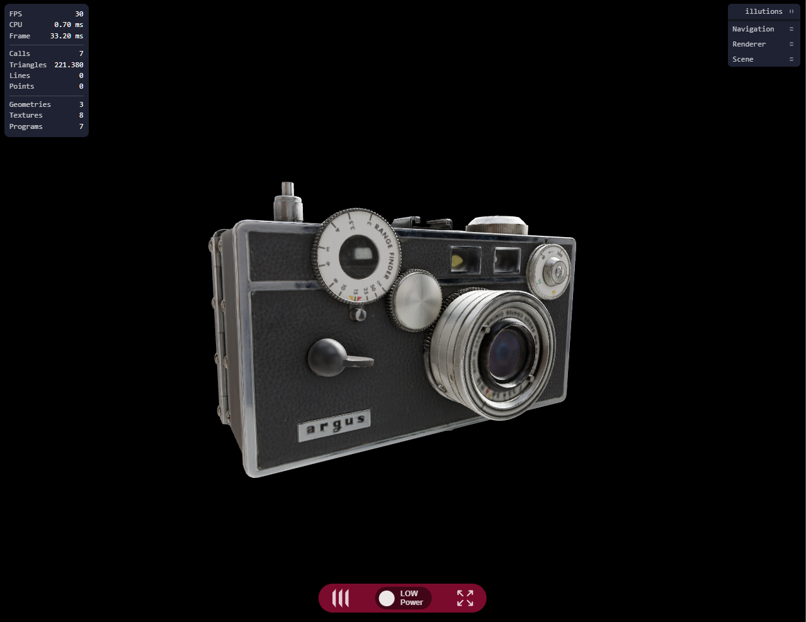

# Illutions Engine Orbit Controls Example

Build interactive browser-based 3D experiences with a compact,
configuration-driven TypeScript setup. This example combines an animated camera,
a production-ready 3D asset, realistic environment lighting, and live controls
in just a few lines of Illutions Engine configuration.

## Live demo

[](https://illutions.github.io/public-orbitctrls/)

**[Launch the interactive demo](https://illutions.github.io/public-orbitctrls/)**
and drag, zoom, or pan around the camera.

## What this example demonstrates

- Smooth orbit controls with automatic camera rotation and configurable limits
- Direct GLTF/GLB model loading and EXR environment lighting
- Antialiased WebGL rendering configured through TypeScript
- Runtime controls for inspecting and tuning the experience
- A focused project structure that is easy to use as a starting point

## Why Illutions Engine

Illutions Engine brings the pieces needed for sophisticated browser-based 3D
applications into one configurable workflow:

- **Advanced post-processing**  
Add SSAO, SSR, FXAA and SMAA through configurable pipelines for WebGL and WebGPU.

- **Advanced animation control**  
Coordinate GLTF animation clips, GSAP transitions, camera paths and custom dolly-rig camera workflows.

- **XState-powered application logic**  
Model complex application flows as predictable and inspectable state machines with integrated XState 5 usage.

- **Resource-aware rendering**  
An intelligent, configurable FPS limiter avoids unnecessary frames and helps reduce CPU and GPU load.

- **WebGL and WebGPU rendering**  
Support established and next-generation browser rendering with automatic WebGPU selection and WebGL fallback.

- **Lean initial bundles**  
Optional controls, loaders, inspectors and effects are dynamically imported only when needed.

- **Optimized GLTF/GLB pipeline**  
Load assets with Draco or Meshopt mesh compression and WebP or KTX2 textures.

- **Built-in interaction and audio**  
Use pointer-based raycasting and distance-aware spatial audio.

- **Flexible environments**  
Load HDR, EXR and texture environments with configurable rotation, intensity and background controls.

- **Runtime insights and debugging**  
Inspect runtime properties, FPS, CPU and renderer statistics with detailed state, event and console reporting.

## Requirements

- Node.js and npm
- A browser with WebGL support

## Installation

```bash
npm install
```

## Development

Start the development server:

```bash
npm run dev
```

The application is served over HTTPS at:

```text
https://localhost:5173
```

The browser may display a warning because the development server uses a local
self-signed certificate.

## Type checking

```bash
npx tsc --noEmit
```

## Build

Create a production build:

```bash
npm run build
```

The generated files are written to `dist/`.

## Preview

Preview the production build locally:

```bash
npm run preview
```

## License

The example code and project configuration are licensed under the
[Illutions Example Code License](LICENSE.md).

The illutions Engine and illutions-provided build tooling are proprietary
software and are licensed separately. Their complete licensing terms are
provided with the [illutions package on npm](https://www.npmjs.com/package/illutions).
Build permissions are determined by `license/license.json`.

Production builds include the applicable Engine and bundled dependency
licenses in `dist/licenses.md`.

## Deployment

The included GitHub Actions workflow automatically builds and deploys the
project to GitHub Pages on every push to the `main` branch. It can also be
started manually from the Actions tab.

In the repository settings under **Pages**, select **GitHub Actions** as the
deployment source. The workflow provides Vite with the GitHub Pages base path,
while local development continues to use the domain root `/`.

## Third-party assets

Third-party assets remain subject to their respective licenses. They are not
relicensed by this repository or by the illutions Engine license.

### Argus Camera

This example uses the [Argus Camera](https://sketchfab.com/3d-models/argus-camera-f9112ea4c15043ebbb24fa121ffef920)
model published by Virtual Museums of Małopolska.

The model is available under the Creative Commons CC0 1.0 Universal license.

### Brown Photostudio 02

This example uses the Brown Photostudio 02 HDRI from Poly Haven.

- **Author:** Sergej Majboroda
- **License:** Creative Commons CC0 1.0 Universal
- **License URL:** https://creativecommons.org/publicdomain/zero/1.0/
- **Source:** https://polyhaven.com/a/brown_photostudio_02
- **Changes:** No changes made. The HDRI is used as the scene environment.

CC0 permits copying, modification, redistribution, and commercial use without
requiring attribution. The source is listed here for transparency and credit.

## Project structure

```text
src/       Application source code and Illutions configuration
public/    Models, environment maps, and layout assets
style/     Global application styles
license/   Illutions license data
```
